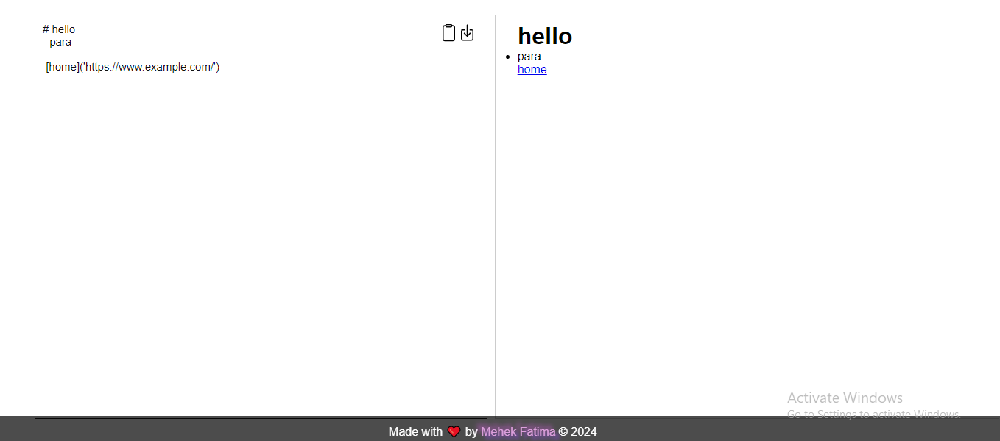

# Code Editor and Markdown Maker

This website aims to provide a sleek Markdown editor with live preview and the ability to download your Markdown content. Additionally, it offer an HTML, CSS, and JavaScript code editor with a limited console functionality.

## Features

### Markdown Editor

- **Live Preview**: See your Markdown content rendered in real-time.
- **Download Markdown**: Easily download your Markdown file.
- **Copy Markdown**: Quickly copy your Markdown content.

### Code Editor

- **HTML, CSS, JS**: Edit HTML, CSS, and JavaScript code.
- **Run Code**: Execute your code in real-time.
- **Download Code**: Download your HTML, CSS, JS files separately.

### Console (Limited Functionality)

- **JavaScript Console**: Execute JavaScript code with limited functionalities.
- **Debugging**: Basic console logging for code debugging.

## Website Screenshots

### Home

### Markdown Editor

### Code Editor 

### Console

## Website Link

Check out the live website: [Code Editor and Markdown Maker](https://devtool-studio.netlify.app/)

## Usage

1. **Markdown Editor**
   - Enter your Markdown content in the left pane.
   - Preview the rendered Markdown on the right.
   - Click the download icon to save your Markdown file.
   - responsive design 

2. **Code Editor**
   - Write HTML, CSS, and JavaScript code in their respective sections.
   - See your code output in the preview window.
   - Download each code file separately using the download icons.
   - responsive design 

3. **Console**
   - The console is limited in functionality.
   - Enter JavaScript code in the console input and press Enter to execute.
   - View results and debug code with console logs.
   - responsive design 

## Technologies Used

- HTML
- CSS
- JavaScript
- [Marked.js](https://marked.js.org/) for Markdown rendering

